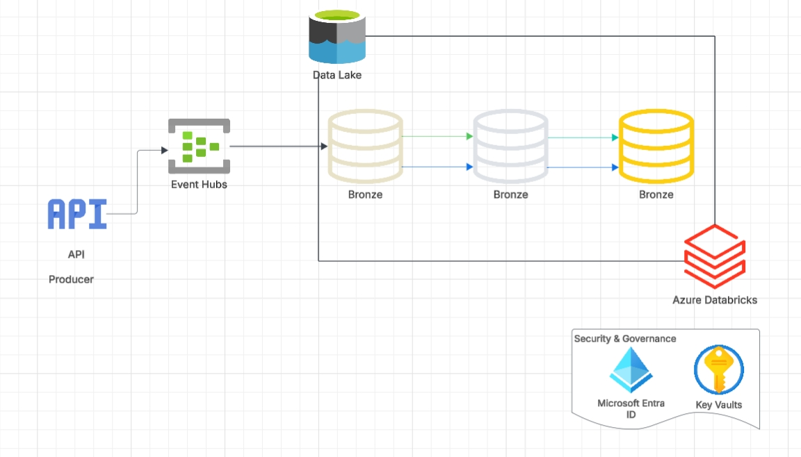

# Real-Time Streaming Pipeline on Azure Databricks Using Event Hub

## Project Overview
This is end-to-end real-time streaming pipeline that ingests cryptocurrency market activity data. Utilizing a **Multiplex Fan-Out architecture**, the pipeline reads multi-entity event streams from an external exchange API, centralizes raw ingestion through **Azure Event Hubs**, and processes data inside **Azure Databricks** using **Spark Declarative Pipelines (SDP)** .

### Key Capabilities
- **Real-Time Streaming Ingestion:** Sub-second latency event processing using Python-based producer scripts pulling from live market websockets/APIs into Azure Event Hubs.
- **Multiplex Fan-Out Pattern:** Consumes a single, unified raw event stream into a single landing table before dynamically splitting it into dedicated, structured downstream schemas.
- **Medallion Architecture:** Standardized data transformation layers managed strictly via **Streaming Tables** (Bronze & Silver) and **Materialized Views** (Gold).
- **Unity Catalog Governance:** Fine-grained data access controls, structured data-lineage tracking, and strict environment separation (Dev, Staging, Prod).
- **Infrastructure-as-Code (IaC):** Continuous Integration and Continuous Deployment (CI/CD) automated using GitHub Actions and **Databricks Automation Bundles (DABs)**.

## Prerequisites & Environment Setup

Before deploying or running local modules, ensure you have the following assets configured:

1. **Active Azure Subscription** with access to a dedicated Resource Group containing:
   - An **Azure Event Hubs Namespace** (Standard or Premium tier recommended for streaming).
   - An **Event Hub** instance configured with specific Shared Access Policies (`Listen` and `Send`).
2. **Azure Databricks Workspace** with full **Unity Catalog enabled**.
3. **Databricks CLI v0.200+** installed locally.
4. **Intermediate to Advanced Knowledge** of PySpark engineering paradigms (Auto Loader, Structured Streaming design, Delta Lake table optimization optimizations, and declarative streaming code layouts).

## Architecture & Data Flow

---

## Medallion Architecture Breakdown

### Bronze Layer: Raw Ingestion
* **Target:** `streaming_tables.raw_multiplex_stream`
* **Implementation:** Powered by **Databricks Auto Loader** (`cloudFiles`) subscribing to the Azure Event Hub storage capture or direct stream checkpointing. 
* **Characteristics:** Append-only, schema-less (stores raw JSON payload, partition paths, and system injection metadata). No transformations occur here.

### Silver Layer: Cleanse & Fan-Out
* **Targets:** `streaming_tables.trades_ticker`, `streaming_tables.products`, `streaming_tables.candle`
* **Implementation:** A **Multiplex Fan-out** engine filters the raw stream based on the `event_type` metadata attribute. 
* **Characteristics:** Enforces standard datatypes, flattens dense nested JSON paths, registers high-volume schema variants safely, and drops structural anomalies.

### Gold Layer: Business Analytics & Reporting
* **Targets:** `materialized_views.fact_market_ohlc_hourly`, `materialized_views.fact_trading_metrics_15m`
* **Implementation:** Built strictly using **Materialized Views (MVs)** to guarantee computation efficiency via incremental state updates.
* **Characteristics:** Houses high-value aggregate calculations including Volume Weighted Average Prices (VWAP), cross-join currency conversions, and standard Open-High-Low-Close (OHLC) financial charts.

---

## Resources
- Send Events to Event Hub using Python: https://learn.microsoft.com/en-us/azure/event-hubs/event-hubs-python-get-started-send?tabs=passwordless%2Croles-azure-portal
- Spark Declarative Pipelines: https://learn.microsoft.com/en-us/azure/databricks/ldp/developer/python-ref
- Coinbase Rest API: https://docs.cdp.coinbase.com/coinbase-app/advanced-trade-apis/rest-api
- Coinbase Rest API: https://docs.cdp.coinbase.com/coinbase-app/advanced-trade-apis/guides/websocket
